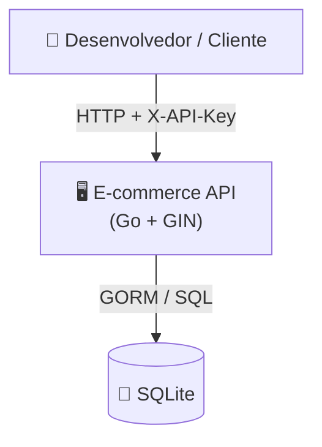

# Arquitetura — E-commerce API

## C4 Context



## Camadas

| Camada | Pacotes | Responsabilidade |
|---|---|---|
| Handler | `internal/handler/cliente`, `produto`, `pedido` | HTTP: deserializa, valida formato, responde |
| Service | `internal/service/cliente`, `produto`, `pedido` | Regras de negócio e validações de domínio |
| Repository | `internal/repository/cliente`, `produto`, `pedido` | Acesso ao banco via GORM |
| Domain | `internal/domain/entity` | Structs de domínio compartilhados entre camadas |
| Middleware | `pkg/middleware` | Autenticação X-API-Key |

## Organização package-per-entity

Cada entidade tem seu próprio pacote em cada camada, com alias de import para evitar conflito de nomes:

```
internal/
  handler/
    cliente/   → package clienthdl
    produto/   → package produtohdl
    pedido/    → package pedidohdl
  service/
    cliente/   → package clientesvc
    produto/   → package produtosvc
    pedido/    → package pedidosvc
  repository/
    cliente/   → package clienterepo
    produto/   → package produtorepo
    pedido/    → package pedidorepo
```

## Fluxo de dependência

```
Handler → (interface local) → Service → (interfaces.go) → Repository → SQLite
```

Cada camada define as interfaces que consome — nunca importa a implementação concreta diretamente:

- **Handler** declara `clienteService interface{...}` no próprio arquivo (unexported, interface mínima)
- **Service** declara `ClienteRepository interface{...}` em `interfaces.go` (exported, usada pelos testes)
- **Repository** importa GORM e a entidade de domínio — é a única camada que conhece o banco

## Wiring (main.go)

```
clienteRepo := clienterepo.New(db)         // *gorm.DB → ClienteRepository (value)
clienteSvc  := clientesvc.New(&clienteRepo) // ClienteRepository interface → *ClienteService
clienteHdl  := clienthdl.New(clienteSvc)   // clienteService interface → *ClienteHandler
```

O `&` em `&clienteRepo` é necessário porque os métodos do repository têm pointer receiver.
